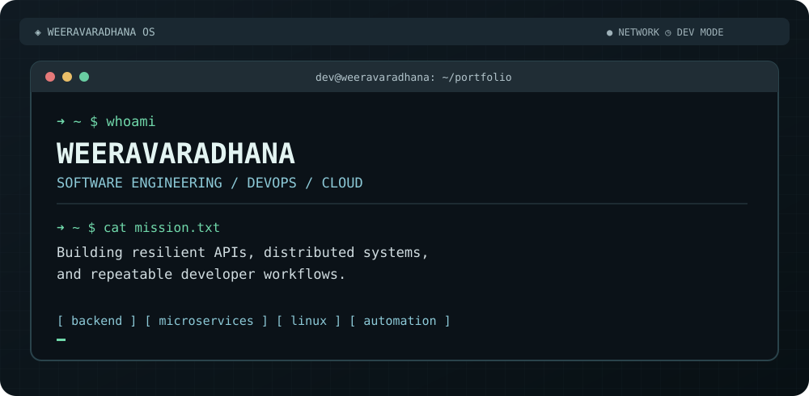

<div align="center">

# `WEERAVARADHANA_OS` 

**A developer workspace, not another badge wall.**

`ubuntu@weeravaradhana:~$ ./launch-portfolio.sh`



[](https://github.com/Weeravaradhana?tab=repositories) [](https://github.com/Weeravaradhana)

</div>

## `~/about $ cat profile.yml`

```yaml
identity: Weeravaradhana
focus: [Software Engineering, Backend Systems, DevOps]
currently_building: [Microservices, APIs, Distributed Systems]
interests: [Cloud Infrastructure, Automation, Observability]
platform: Linux
philosophy: "Build it clearly. Test it thoroughly. Ship it reliably."
```

## `~/stack $ tree -L 2`

```text
stack/
├── backend/
│   ├── Java · Spring Boot
│   ├── TypeScript · NestJS · Node.js
│   └── REST · GraphQL · Microservices
├── infrastructure/
│   ├── Docker · Linux · GitHub Actions
│   ├── AWS · CI/CD
│   └── Kafka · Redis
├── data/
│   ├── PostgreSQL · MySQL
│   └── MongoDB · Prisma
└── frontend/
    ├── Next.js · React
    └── Angular
```

## `~/workspaces $ ls -la`

| Workspace | What you'll find |
| :--- | :--- |
| [`api-monitoring/`](https://github.com/Weeravaradhana?tab=repositories&q=monitoring) | API uptime monitoring, scheduled checks and analytics |
| [`event-ticketing/`](https://github.com/Weeravaradhana?tab=repositories&q=event) | Event management and service-oriented backend design |
| [`notification-engine/`](https://github.com/Weeravaradhana?tab=repositories&q=notification) | Kafka-based messaging and event-driven notifications |
| [`distributed-services/`](https://github.com/Weeravaradhana?tab=repositories) | Service gateways, authentication, caching and persistence |

## `~/engineering $ cat principles.md`

```text
[01] Design for maintainability, not just a successful demo.
[02] Make failures observable and recovery intentional.
[03] Automate repeatable workflows.
[04] Keep services small, interfaces explicit, and tests meaningful.
[05] Treat security and documentation as engineering work.
```

## `~/activity $ git log --oneline --graph`

<div align="center">


</div>

## `~/contact $ echo $GITHUB`

**GitHub:** [github.com/Weeravaradhana](https://github.com/Weeravaradhana)  
**Explore code:** [Public repositories](https://github.com/Weeravaradhana?tab=repositories)

<div align="center">

```text
┌──────────────────────────────────────────────────────────┐
│  SESSION: ACTIVE      STATUS: BUILDING      EXIT: NEVER  │
└──────────────────────────────────────────────────────────┘
```

<sub>Designed as a Linux-inspired engineering workspace · WEERAVARADHANA_OS</sub>

</div>
