##  My GitHub Contributions

  

###  TECH STACK IN MOTION

###  PROJECT STREAM

### 🛰️ CURRENT GITHUB SIGNAL

Live project and activity panels are regenerated automatically by GitHub Actions. Public GitHub data only. Animations may be reduced by viewer accessibility settings or SVG rendering restrictions.
